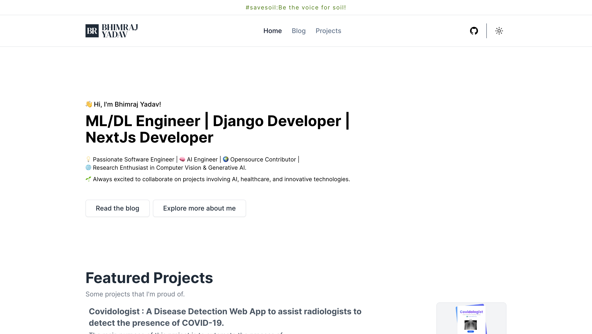

<p align="center">
  
  <br/>
  <b>BHIMRAJ YADAV</b><br/>

## Preview



## Tech Stack

- **Framework**: [Next.js](https://nextjs.org/)
- **Content**: [Content Collections](https://www.content-collections.dev/)
- **Styling**: [Tailwind CSS](https://tailwindcss.com/)
- **Deployment**: [Vercel](https://vercel.com/)

## Overview

- `public/*` - Static assets including fonts and images.
- `src/*` - All other components and pages.

## Deploy your own

Deploy the example using [Vercel](https://vercel.com?utm_source=github&utm_medium=readme&utm_campaign=next-example):

[](https://vercel.com/new/git/external?repository-url=https://github.com/vercel/next.js/tree/canary/examples/with-tailwindcss&project-name=with-tailwindcss&repository-name=with-tailwindcss)

## Local development

Execute following commands.

````bash
$ git clone https://github.com/bhimrazy/bhimraj.com.np.git
$ cd bhimraj.com.np
Install Bun: `curl -fsSL https://bun.sh/install | bash`

With Bun:

```bash
bun install
bun run dev
````

## Quality checks

- Type check: `bun run typecheck`
- Lint: `bun run lint`
- Format: `bun run format:write`
- All checks: `bun run check`

```

Deploy it to the cloud with [Vercel](https://vercel.com/new?utm_source=github&utm_medium=readme&utm_campaign=next-example) ([Documentation](https://nextjs.org/docs/deployment)).
```
